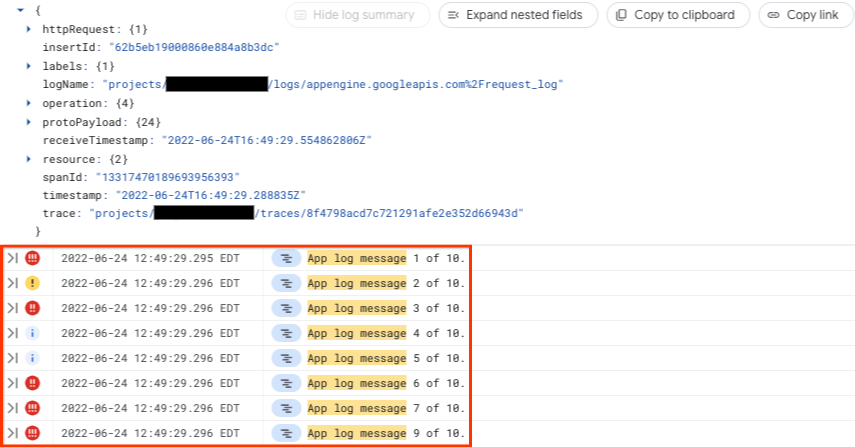
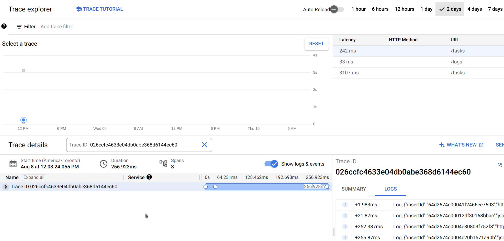

# Instrument your microservices for tracing

Distributed tracing becomes necessary when you want to correlate multiple requests that originates from a single user interaction with your **SaaS**.
It becomes useful as soon as you synchronize systems from third-party providers using **webhooks** or interact with APIs enforcing **rate limiting**. This introduces asynchronous distributed tasks throughout the web app.

Can you easily tell which request triggered the webhook or caused the schedule of an asynchronous task? What if the cause of an error actually lies in a past request?
**Instrumenting** for distributed tracing and logging gives great insights on a **complete flow** about :

- the involved services
- its overall performance
- identifying undesired delays
- determining the **root cause** of unexpected errors
- validating the expected behavior
- whether the behavior is impacted by the performance

## Tracing Instrumentation

You can easily instrument your application with [Cloud Trace](https://cloud.google.com/trace), especially when the app is hosted on Google Cloud Platform. Let's cover how to do it when leveraging [Cloud Run](https://cloud.google.com/run) & [Cloud Tasks](https://cloud.google.com/tasks) in the context of interacting with a third-party API enforcing rate limiting. Node is used for this example, but the concepts are language agnostic.

#### Exclusions

- Security best practices are out of scope of this article and we recommend applying the [principle of least privilege](https://en.wikipedia.org/wiki/Principle_of_least_privilege) when [managing access to your cloud services](https://cloud.google.com/iam).
- CI/CD and IaC related to managing & provisioning these cloud services is also omitted
- TODO: call to action

### Don’t hesitate to [schedule a meeting](https://calendly.com/d/zvm-hyy-f7j/first-contact) with us for any help about these topics.

[img]

When processing a request from the user, the `task service` interacts with a rate limited third-party API (e.g. maximum 2 requests per second). Interactions are queued in Cloud Tasks which dispatches at an acceptable rate.

The complete flow is as follow :

- the user interacts
- the `task service` queues to Cloud Tasks targeting the `task executor`
- the `task executor` fulfills the interaction by consuming the third-party API

_(coming soon)_ Check here how to deploy and manage this infrastructure.

1. The goal will be to correlate the original request from the user with the actual request that executes the task.
2. Additionally, we want to group the related logs. Despite the complex nature of distributed systems, we can achieve this with minimal configuration.

Note that Cloud Trace leverages & encourages [OpenTelemetry](https://opentelemetry.io/). It is assumed that you already know its [concepts](https://opentelemetry.io/docs/concepts/). Being open-source, OpenTelemetry allows vendor-agnostic instrumentation of your SaaS product.

## Propagate `traceparent`

Cloud Run supports the standard W3C trace context propagation header [`traceparent`](https://www.w3.org/TR/trace-context/#traceparent-header). This header is present on each Cloud Run request. So the key idea is to override this header for each request deriving from a user interaction.

> You can of course do this whether the request directly targets another service on Cloud Run or through Cloud Tasks.

```js
const task = await tasksClient.createTask({
  parent: tasksClient.queuePath(logging.projectId, location, "queue"),
  task: {
    httpRequest: {
      httpMethod: "POST",
      url: `https://task-executor.com/interactions`,
      headers: {
        traceparent: request.get("traceparent"),
      },
    },
  },
});
```

## Grouping the request logs

This example uses the available Cloud Logging SDK for Node. See [Cloud Logging client libraries](https://cloud.google.com/logging/docs/reference/libraries) for alternatives.

For the second part of our goal, we can leverage the header [X-Cloud-Trace-Context](https://cloud.google.com/logging/docs/view/correlate-logs#setup). This header is present on each Cloud Run request. You can extract this context and include it in your log entry.

> Depending on your stack, some librairies will automatically add the trace context when logging.

> You might also want to further instrument by creating your own spans instead of reusing it. OpenTelemetry also provides plenty of [tools](https://github.com/open-telemetry/opentelemetry-js-contrib/tree/main/metapackages/auto-instrumentations-node#user-content-supported-instrumentations) to auto instrument your application.

```js
import { Logging } from "@google-cloud/logging";

const logging = new Logging();
await logging.setProjectId();
await logging.setDetectedResource();

app.use((req, res, next) => {
  // spec: "X-Cloud-Trace-Context: TRACE_ID/SPAN_ID;o=TRACE_TRUE"
  const traceHeader = req.get("X-Cloud-Trace-Context");
  const [traceId, spanId] =
    traceHeader?.split("/").flatMap((id) => id.split(";")) || [];

  const log = logging.logSync("stdout");
  log.info(
    log.entry(
      {
        labels: { tt: "42" },
        spanId,
        trace: `projects/${logging.projectId}/traces/${traceId}`,
      },
      "correlated log"
    )
  );

  next();
});
```

## Results: Visually observing the correlations

In the [Log Explorer](https://cloud.google.com/logging/docs/view/logs-explorer-interface), for each [request log](https://cloud.google.com/run/docs/logging), you now have your related logs nested in the.



And in the [Trace Explorer](https://cloud.google.com/trace/docs/finding-traces), you have all the logs for the complete flow.



Available [source code here](https://github.com/junifia/poc-gcp-distributed-tracing).

### What's next:

- _(coming soon)_ How to correlate requests when third-party systems are involved (e.g. webhooks)
- _(coming soon)_ Tracing instrumentation for the frontend using Firebase Hosing

### References

- https://cloud.google.com/architecture/microservices-architecture-distributed-tracing#distributed_tracing
- https://cloud.google.com/run/docs/trace
- https://cloud.google.com/logging/docs/view/correlate-logs#setup
- https://cloud.google.com/run/docs/logging#correlate-logs
- https://cloud.google.com/logging/docs/structured-logging
